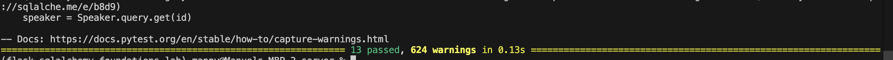

# Lab: Flask SQLAlchemy Relationships

## Overview
EventWise is a small Flask API that models relational data using Flask-SQLAlchemy:
- One-to-many: Event ➜ Sessions
- One-to-one: Speaker ➜ Bio
- Many-to-many: Sessions ↔ Speakers (via `session_speakers`)

## API Endpoints
- GET `/events`
- GET `/events/<id>/sessions`
- GET `/speakers`
- GET `/speakers/<id>`
- GET `/sessions/<id>/speakers`

## Screenshot


## Tools & Resources

- [GitHub Repo](https://github.com/learn-co-curriculum/flask-sqlalchemy-relationships-lab)
- [SQLAlchemy ORM Documentation: SQLAlchemy ORM](https://docs.sqlalchemy.org/en/14/orm/)
- [Flask-SQLAlchemy Documentation: Flask-SQLAlchemy](https://flask-sqlalchemy.palletsprojects.com/)

## Set Up

Fork and clone the lab repository.

Run the following commands:

```bash
$ pipenv install
$ pipenv shell
```

Navigate into the server/ directory and set environment variables:

```bash
$ cd server
$ export FLASK_APP=app.py
$ export FLASK_RUN_PORT=5555
```

You will find:
* `models.py` – already created but empty.
* `seed.py` – contains starter seed data (you will run this later after models are built).
* `testing/` – directory with test suites for models and endpoints to check your work.
* `app.py` – Flask app setup ready for you to add endpoints.

